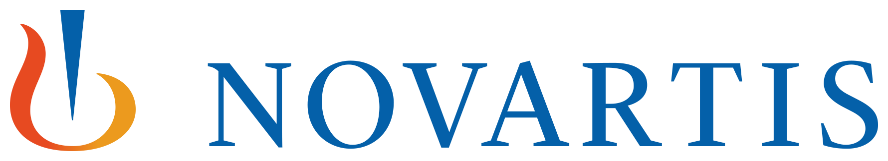

  
  <h1>AI-Powered Clinical Trial Recommendation System</h1>
  

    <strong>Semifinalist at NEST 2025 Hackathon 🏆</strong> 
    Transforming clinical trial design through advanced AI recommendations
  

## 🌟 Project Overview

Our innovative solution, developed for the Novartis-sponsored NEST 2025 Hackathon, revolutionizes clinical trial design by leveraging:
- Advanced AI and semantic technologies
- Scalable knowledge graphs
- Intelligent recommendation algorithms

The system processes over 450,000 clinical trials to deliver strategic insights that streamline pharmaceutical R&D processes.

  
    
  

## 🎯 Key Results

  <table>
    <tr>
      <!-- Increased width from 200 to 300 for larger, more readable images -->
      <td align="center"></td>
      <td align="center"></td>
      <td align="center"></td>
    </tr>
    <tr>
      <td align="center"><b>Trial 1 Recommendations</b></td>
      <td align="center"><b>Trial 2 Recommendations</b></td>
      <td align="center"><b>Trial 3 Recommendations</b></td>
    </tr>
  </table>

## 📊 Contents

- **Python Scripts**: Production-ready implementation (`Python Scripts/`)
- **Jupyter Notebooks**: Interactive documentation and code (`Python Notebooks/`)
- **Neo4j Visualization**: Interactive knowledge graph explorer (`neo4j_graph_visualization.html`)
- **Performance Metrics**: System evaluation tools (`metric_evaluation.py`)

## 🚀 Quick Setup

### Prerequisites

### Run the Scripts
Set up the database and prepare the environment by running the provided scripts in sequence:
1. `CreateRelationship.py`
2. `SimilarEntities.py`
3. `ingest.py`
4. `model.py`

## 🛠️ Components

- **Data Preprocessing**: Scripts to clean and prepare clinical trial data
- **Knowledge Graph Construction**: Uses Neo4j to build a scalable graph representing clinical trial data
- **Recommendation Engine**: Utilizes Jaccard similarity metrics within Neo4j's GDS to rank similar clinical trials
- **Similar Entity Detection**: Advanced node merging capabilities using FAISS for semantic similarity

## How to Use

You can choose to run either the Python scripts or the Jupyter notebooks, depending on your preference:

1. **Python Scripts**: 
   - Navigate to the `Python Scripts` folder
   - Execute the desired script using a Python interpreter (e.g., `python script_name.py`)

2. **Jupyter Notebooks**: 
   - Navigate to the `Python Notebooks` folder
   - Open the notebooks using Jupyter Notebook, Jupyter Lab, or any compatible IDE
   - Follow the provided markdown instructions for better insights into each step of the code

## 🏆 Achievements

-- **NEST 2025 Semifinalist:** *Team Newbie Neurons* — Recognized at [Unstop](https://unstop.com/competitions/novartis-nest-novartis-1213177/case-submissions/481313) for our innovative approach.
- **High Accuracy**: 0.857 cosine similarity score
- **Enterprise-Ready**: Cloud-native architecture
- **Scalable Solution**: Processes 450,000+ trials efficiently

## Additional Resources

- **Report**: A comprehensive report summarizing the system's architecture, methodology, and results (`report.pdf`)
- **Metric Evaluation**: Code for evaluating the system's performance (`metric_evaluation.py`)
- **User Guide**: Detailed instructions on setting up and using the repository - [View User Guide](Python%20Notebooks/UserGuide.pdf)

Both script and notebook approaches are identical in terms of functionality and code. Feel free to use whichever format suits your workflow!
